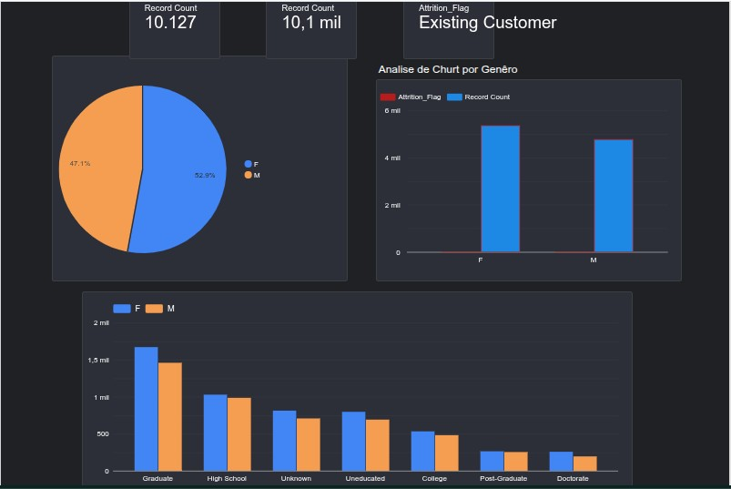
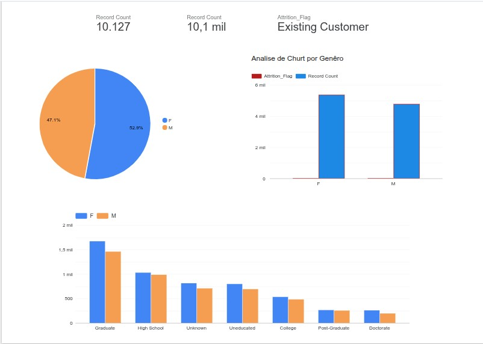

# 📊 Estratégia de Retenção e Rentabilidade (Churn & LTV) - Setor Financeiro

Este projeto apresenta uma solução consultiva para um dos maiores desafios de empresas de serviços e finanças: a **evasão de clientes (Churn)**. Mais do que uma análise técnica, este repositório demonstra como transformar dados brutos em ações estratégicas de CRM e Marketing para aumentar o **Lifetime Value (LTV)**.

---

## 🎯 Objetivo de Negócio
Identificar padrões comportamentais e demográficos que antecedem o cancelamento de serviços e propor planos de ação para a retenção de clientes de alto valor.

---

## 🛠️ Tecnologias e Habilidades
* **SQL:** Extração, limpeza e manipulação de bases de dados relacionais.
* **Python (Pandas/Seaborn):** Análise Exploratória de Dados (EDA) e correlação estatística.
* **Power BI:** Storytelling visual e Dashboards de monitoramento de KPIs.
* **Visão de Negócio:** Foco em indicadores de CRM, Financeiro e CX.

---

## 📈 Perguntas de Negócio Respondidas
1. **Qual o perfil do cliente com maior taxa de cancelamento?**
2. **Qual o impacto financeiro (perda de receita) gerado pelo Churn atual?**
3. **Existe correlação entre a baixa utilização do limite de crédito e a saída do cliente?**
4. **Quais grupos de clientes devem ser priorizados em uma campanha de retenção?**

---

## 📂 Estrutura do Projeto
* `/sql_queries`: Scripts de tratamento e criação de métricas.
* `/notebooks`: Análise detalhada em Python com insights diagnósticos.
* `/dashboard`: Link ou arquivo para visualização gerencial.

## 🔗 Dashboard Interativo (Looker Studio)

Acesse o dashboard em tempo real clicando no link abaixo:

https://datastudio.google.com/u/0/reporting/8650d20d-136e-4cab-9ecf-b3571fc0936a/page/7GzvF?s=r_R_LKksbSc

---

## 🛡️ Governança e LGPD
Este projeto utiliza dados anonimizados e segue as boas práticas de governança e proteção de dados sensíveis.

